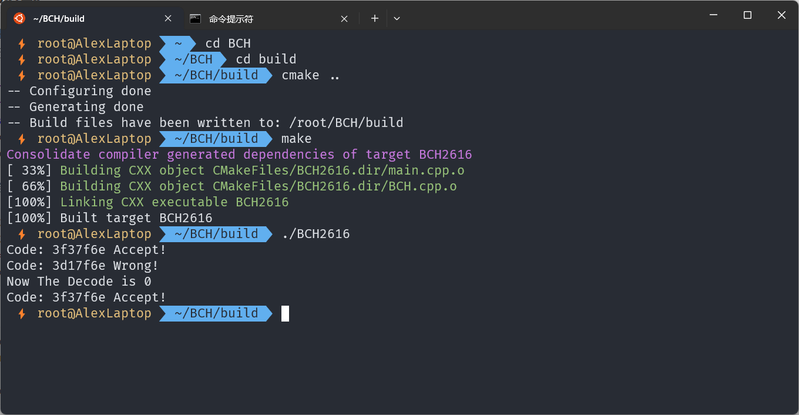

# 题目10-BCH编码的原理及简单实现—by 汤子锋

> 环境：Ubuntu 22.04 LTS in WSL2
>
> 编译器：gcc version 11.3.0 (Ubuntu 11.3.0-1ubuntu1~22.04)

## 0x01 BCH编码

BCH码是一种有限域中的线性分组码，具有纠正多个随机错误的能力，通常用于通信和存储领域中的纠错编码。BCH码定义如下：给定任意一个有限域GF(q)及其扩展域GF(q^m)，其中q是素数或素数的幂，m为正整数。对于任意一个码元取自扩展域GF(q^m)的循环码(n,k)，其中n=2^m-1，其生成多项式g(x)具有2t个连续的根{a^1,a^2,a^3,...,a^{(2t-1)},a^{(2t)}}，则由生成多项式g(x)编码产生的循环码称为q进制的BCH码，记为(n,k,t)。当码长n=2^m-1，称为本原BCH码，否则称为非本原BCH码。

简单来说，BCH编码是一种重要的纠错码，通过将待发送数据的信息位和生成的校验位组成码字发送给接收方，接收方通过协议商量的生成多项式检查接受的数据是否出错，并且具有一定的纠错能力。

## 0x02 BCH编码原理

将待发送的数据记为多项式：

C(x)=c_0+c_1*x^1+c_2*x^2+...+c_{k-1}*x^k-1, m_i = {0,1}

将协议的生成多项式记为：

G(x)=g_0+g_1*x1+g_2*x^2+...+g_r*x^r

由以上计算出校验位：

R(x)=x^r*C(x) \mod G(x)

将得到的多项式和校验位组合成码字多项式：

Code(x)=x^r*m(x)+x^r*m(x) \mod G(x)

码字多项式即为生成的BHC编码

## 0x03 BCH解码原理

接收方收到的码字多项式模生成多项式可以得到校验位：
R(x)=x^r*C(x) \mod G(x)

如果校验位为0，则接收的数据没有错误。

如果校验位不为0，可以通过纠错来纠正有限位的错误

## 0x04 BCH 纠错原理

这里以较短的BCH(26,16)为例，它的数据位为16位，校验位是10位，码字的长度为26位。BCH(26,16)码取(31,21)循环码中的前5位信息位为0的码字作为码字，构成(21-5)维的线性子空间，它最多能够纠正t=2位错误(n-k\equiv mt，其中m是GF(p^m)中的m，这里的m=5,n=31,k=21)。我们已经知道R(X)，生成多项式G(X)和R(X) mod G(X)的余数r(X)，现在需要求出C(X)。r(X)={R(X)}\mod{G(X)}={C(X)+E(X)}\mod{G(X)}={E(X)}\mod{G(X)}

其中，E(x)为000...1...00000，即出错的位数。此时，我们发现，每一个E(x)都唯一对应着一个r(x)，并且可以通过上式求出。因此我们可以建立一个表格，建立起E(x)和R(x)的一一映射，通过得到的R(x)来反求出E(x)，知道了出错的位数就可以很简单的纠错了。

两位出错的情况，只用双重循环遍历两个出错的可能位点，那么r(X) = E_1(X) \mod G(X) + E_2(x) \mod G(X)，分别纠正即可

下面给出纠错的具体实现

```c++
void BCH::Correct() {
    if (code == 0 || gx == 0)
        return;
    uint32_t calc_code = code;
    for (int i = 0; i < 16; ++i) {
        if (calc_code & 0x2000000)
            calc_code ^= gx;
        calc_code <<= 1;
    }
    uint32_t ans = calc_code >> 16;
    if (ans == 0)
        return;
    //一位错误
    for (int i = 0; i < 26;++i) {
        if (ans == table[i].first) {
            code ^= table[i].second;
            return;
        }
    }
	//两位错误
    for (int i = 0; i < 26;++i) {
        for (int j = i + 1; j < 26;j++) {
            uint32_t w1 = table[i].first;
            uint32_t w2 = table[j].first;
            if (ans == (w1 ^ w2)) {
                code = code ^ table[i].second ^ table[j].second;
                return;
            }
        }
    }
}
```

## 0x05 BCH(26,16)的C++实现（部分函数）

```c++
//成员说明
class BCH {
    private:
        uint32_t cx;    //信息位
        uint32_t gx;    //生成多项式
        uint32_t rx;    //校验位
        uint32_t code;	//码字

        std::pair<uint32_t, uint32_t> table[26]; //纠错表：RX->EX的映射，分布在26位上

    public:
        BCH(int c = 0, int g = 0);	//这里初始化纠错表
        ~BCH();
        uint32_t get_RX();	//求校验位
        uint32_t get_Code() const;	//返回码字（测试用）
        int Decode();	//解码
        int Encode();	//编码
        void Recv_code(uint32_t recv);	//更改码字（测试用）
        void Show_code() const;	//输出码字
        void Correct();	//纠错
        void Check();	//检验码字是否出错（直接打印）
};
```

```c++
//模2除法的简单实现：
//如果信息位的最高位为1，就和生成多项式异或
//每次将信息位左移1位
//这里为了方便运算，将信息位和生成多项式全部在26位对齐，当然最后还要还原，得到10位校验位
uint32_t BCH::get_RX() {
    if (cx == 0 || gx == 0)
        return 0;
    uint32_t calc_cx = (cx << 10);
    int tmp = calc_cx;
    for (int i = 0; i < 16; ++i)
    {
        if (calc_cx & 0x2000000)    //0x2000000 == 0010 0000 0000 0000 0000 0000 0000
            calc_cx ^= gx;
        calc_cx <<= 1;
    }
    rx = calc_cx >> 16;
    return rx;
}
```

```c++
//编码：将信息位左移10位，再将校验位填充进去即可
int BCH::Encode() {
    if (cx == 0 || gx == 0)
        return -1;
    get_RX();
    code = ((cx << 10) | rx);
    return code;
}
```
```c++
//解码：通过码字求出r(x)
int BCH::Decode() {
    if (code == 0 || gx == 0)
        return -1;
    uint32_t calc_code = code;
    for (int i = 0; i < 16; ++i) {
        if (calc_code & 0x2000000)
            calc_code ^= gx;
        calc_code <<= 1;
    }
    calc_code >>= 16;
    //std::cout << "!" << std::hex << calc_code << std::endl;
    return calc_code;
}
```
```c++
//构造函数：主要用来生成纠错表
//通过遍历可能出错的地方，和G(x)取模来获得映射的R(x)值
//这里有个优化的方法，若出错的信息位（E(X)）不满10位，那么余数就是他自身，无需再求
BCH::BCH(int c, int g) {
    gx = g;
    cx = 1 << 15;
    for (int i = 0; i < 16;++i) {
        get_RX();
        table[i].first = rx;
        table[i].second = cx << 10;
        cx >>= 1;
    }
    cx = 1 << 9;    //rx = ex
    for (int i = 0; i < 10; ++i) {
        table[i + 16].first = cx;
        table[i + 16].second = cx;
        cx >>= 1;
    }
    rx = 0;

    cx = c;
    rx = code = 0;
}
```

其余实现见源码部分

## 0x06 测试

首先实例化一个BCH对象，并令信息位为`1111110011011111B`，令生成多项式为`10110111001B`（这里参考《信息论与编码》），并对该对象进行编码，得到码字，并确认对生成多项式是正确的

```c++
const uint32_t mycx = 0xfcdf;   //1111110011011111
const uint32_t mygx = 0x05b9 << 15; //填充位数
BCH a(mycx, mygx);
a.Encode();
a.Check();
```

此时模拟传输过程中出现故障，第18位，22位出错（即将原码字和`00001000100000000000000000B`异或）

```c++
uint32_t wrong1 = 0x220000;     //00001000100000000000000000B
uint32_t tmp = a.get_Code();
tmp = tmp ^ wrong1;
a.Recv_code(tmp);
```

再次解码，发现接收数据有误，进行自动纠错，纠错完成后再次解码，确认错误已经被修正

```c++
a.Check();
a.Correct();
cout << "Now The Decode is " << a.Decode() << endl;
a.Check();
```

编译及运行结果如下所示：



由此，BCH(26,16)的编码和解码以及纠错成功实现。

## 0x07 源码

见src目录。

编译运行

```bash
cd src/build
cmake ..
make
./BCH2616
```


